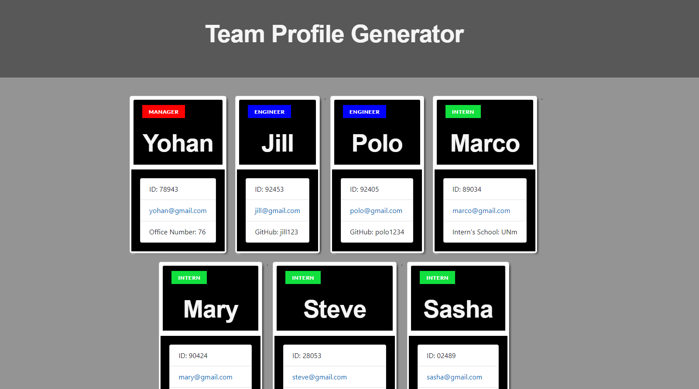

# Team Profile Generator

---

## Description 

*Description of the project; including the what, the why and the how:* 

A Node.js command-line application that takes quickly intakes information about employees on a software engineering team and generates an HTML webpage of the team profile with summaries for each person.

## Table of Contents
* [Installation](#installation)
* [Usage](#usage)
* [Contributing](#contributing)
* [Tests](#tests)
* [License](#license)
---

## Installation

*Instructions required to install and run the project:*

* Clone the github respository
* Install the necessesary node modules (identified in the package.json file)
* Application can then be invoked via the node index.js command

---

## Usage 

*Instructions and, if applicable, examples for use.:*
Via node js

## Preview
 
[See a Demo here](https://drive.google.com/file/d/1sIGcl74jkarz6SYc0q0CftVQC_vjzR2m/view)
---

## Tests

*Tests used and how they are ran:*
Jest was implemented to run the TDD unit tests.
---

## License

undefined

---

## Questions?

For any questions, please feel free to reach out to me:

GitHub: [@asanchez325](https://api.github.com/users/asanchez325)
